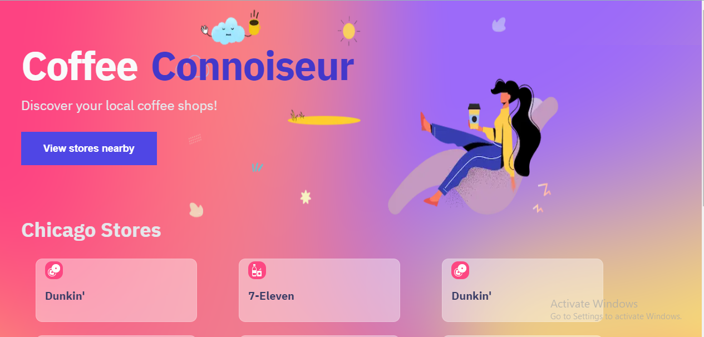

## Table of contents

- [Overview](#overview)
  - [Screenshot](#screenshot)
  - [Links](#links)
  - [Built with](#built-with)
  - [What I learned](#what-i-learned)
- [Author](#author)

## Overview

### Screenshot

### Links
A nextJS application used to view coffee stores around.
<!-- fsq3W0srXFeRwVKAyPT5zqHlDJwgvupr6mGU+8gvrr1YOEw= -->

- Foursquare docs[https://location.foursquare.com/developer/reference/api-overview]
- MDN Geolocation API docs [https://developer.mozilla.org/en-US/docs/Web/API/Geolocation_API/Using_the_Geolocation_API]
- Solution URL: [https://github.com/PrincessMaggy/coffee-app.git]
- Live Site URL: [https://coffee-app-sandy.vercel.app/]

### Built with

- NEXT JS 
- React JS
- CSS custom properties
- 

### What I learned
- ...

## Author

- Website - [Maggy](https://princessmaggy.github.io/My-Portfolio/)
- Frontend Mentor - [@Maggy](https://www.frontendmentor.io/profile/princessmaggy)
- Twitter - [@princessMaggy7](https://www.twitter.com/princessMaggy7)
